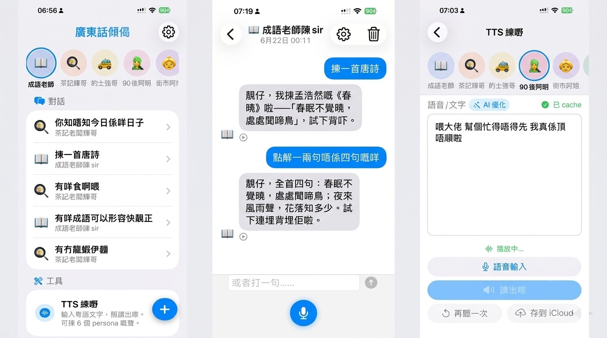

# Cantonese Chat iPhone (廣東話傾偈)

> **粵語 voice chat iOS app** — 直接 hit MiniMax cloud (LLM + TTS) + iOS on-device 粵語 STT。
> 6 個 persona 對話 + AI 粵語優化 + iCloud export。

<p align="center">
  
</p>

## 功能

- **6 個 persona 對話** — 茶餐廳老闆輝哥 / 成語老師陳sir / 的士司機強哥 / 後生仔阿明 / 街市阿姐 / 阿sir / 每個 persona 各自有不同語氣
- **TTS Lab** — 輸入語音或文字 → ✨ AI 粵語優化 (A.I.改寫成更地道口語) → 讀出嚟
- **iCloud export** — 將生成的音頻存到 iCloud Drive
- **自動聲紋分析** — 透過 mic 語音輸入, Settings 入面自動判斷性別年齡
- **粵語 pronunciation override** — `CantoneseVoiceChat/Resources/pronunciation_overrides.txt` 一行一個 entry, 強制 TTS 讀正確粵音

## 聲紋性別/年齡偵測

iPhone 真機透過 mic 即時分析你嘅聲音, 自動分類為 7 種 `VoiceType`, 推斷 **性別 (Gender)** 同 **年齡組別 (AgeGroup)**, 結果會注入 persona 嘅 LLM system prompt, 令回應語氣自動調整 (例如對女性用詞更柔和, 對長者更客氣)。

### VoiceType 分類表

| VoiceType | Pitch range (Hz) | 推斷 Gender | 推斷 AgeGroup | 顯示 |
|---|---|---|---|---|
| `.child`        | 220...450 | unknown | child  | 🧒 小朋友 |
| `.youngFemale`  | 165...255 | female  | young  | 👩 後生女 |
| `.youngMale`    | 85...180  | male    | young  | 👨 後生仔 |
| `.middleFemale` | 150...230 | female  | middle | 👩‍💼 中年女 |
| `.middleMale`   | 75...165  | male    | middle | 👨‍💼 中年男 |
| `.seniorFemale` | 140...220 | female  | senior | 👵 長者女 |
| `.seniorMale`   | 70...160  | male    | senior | 👴 長者男 |
| `.unknown`      | 0...1000  | unknown | unknown | ❓ 未辨識 |

### 運作流程

1. iPhone 真機 mic 透過 `AVAudioEngine` tap 攞 raw audio buffer (@ 48kHz mono float)
2. 每個 buffer call `SpeakerProfile.update(level:audioBuffer:)`:
   - Skip 靜音 frame (RMS < 0.02)
   - **Downsample 落 16kHz** (mean filter 抗混疊, 因為 iPhone mic 個 sample rate 通常 44.1kHz / 48kHz, autocorrelation 對 16kHz 先穩定)
   - 切 4 個 sub-window (32ms each, 50% overlap)
   - 每個 sub-window 跑 autocorrelation 攞 pitch
   - **Median** of sub-windows 抵抗 noise (比 EMA 對 single outlier 更 robust)
   - 對齊過往 10 個 pitch sample median
   - **Octave correction**: 如果 2x lag 個 correlation ≥ 0.7 × best lag → 用 lower octave (避免 first peak 喺 2nd harmonic 嘅錯位)
3. 最終 pitch 落 `classifyVoice(pitch:)` heuristic:
   ```swift
   if pitch < 165 { return .middleMale }
   if pitch < 200 { return .seniorMale }
   if pitch < 250 { return .youngFemale }
   if pitch < 270 { return .youngFemale }
   if pitch < 350 { return .middleFemale }
   return .child
   ```
4. `voiceType` 變化 emit `objectWillChange`, `ChatViewModel.makeSpeakerContext()` 重新生成 speaker context string
5. 下次 LLM call, 個 system prompt 已經包括性別 + age hint, persona 自動調整

### System prompt 注入

`ChatViewModel.makeSpeakerContext()` 會喺 persona 個 `systemPrompt` 之後 append:

```
提示: 用戶係中年男, 聲音係男性, 用戶叫「Peter」。
稱呼建議: 用「靚仔」「先生」「老闆」。
講嘢時可以適當調整語氣 (例如對長者客氣啲, 對後生仔可以 casual 啲)。
```

LLM 會自動根據 hint 改用詞 / 語氣 (e.g. 對長者唔用 slang, 對後生仔可以用英文夾雜)。

### 持久化

`SpeakerProfile` 嘅 `voiceType` / `averagePitch` / `averageEnergy` / `sampleCount` 會 codable 寫入 UserDefaults, 跨 session 保留。

### 限制

- **第一次講嘢即時 classify** (第 1 個 buffer 之後已經 update `voiceType`)
- 起步時 `voiceType = .unknown`, 第 1 個 audio 已經走得 voice type
- **小朋友 vs 女性 adult** 嘅 pitch range 有 overlap (220-255 Hz), 邊界 case 可能誤判
- 情緒 / 感冒 / 變聲會影響 pitch
- **唔會儲存 biometric data** (冇 audio recording, 純 statistical analysis)
- 依賴 iPhone mic 收到嘅 audio 完整性: 太多 ambient noise (餐廳 / 街) autocorrelation 個 pitch 會估錯

## Quick start

### Requirements

- macOS + Xcode 26+
- iPhone (iOS 17+)
- [xcodegen](https://github.com/yonaskolb/XcodeGen): `brew install xcodegen`
- MiniMax API key (Settings 個 input 填)
- Apple Developer Team (改 `<YOUR_APPLE_TEAM_ID>` 喺 `project.yml` + `CantoneseVoiceChat.xcodeproj/project.pbxproj` 入面)

### Setup

```bash
git clone git@github.com:elbartohub/CantoneseChat.git
cd CantoneseChat
xcodegen generate                    # regen Xcode project

# Edit project.yml: 將 YOUR_TEAM_ID 換做你個 Apple Team ID
# Edit CantoneseVoiceChat.xcodeproj/project.pbxproj: 同上
# (搵 4 個 DevelopmentTeam = YOUR_TEAM_ID 改返你個 team id)

open CantoneseVoiceChat.xcodeproj

# Xcode 入面揀你 iPhone 做 destination, 撳 Run (⌘R)
```

### 第一次跑

1. iPhone 開 app → 見到 Welcome screen (auto-dismiss 1s)
2. OnboardingView step 0 撳「開始」→ 進入 API key 設定
3. OnboardingView step 1 填 MiniMax API key (sk-... or ey...) → 撳「開始傾偈」(Key 必填, 唔填撳唔到掣)
4. HomeView → 撳 TTS Lab tile 試 TTS / 或直接撳 persona chip 開始 chat
5. 揀 persona chip (e.g. 📖 成語老師)
6. 輸入粵語文字 (TextEditor 直接打 OR 撳 🎙️ mic 掣語音輸入 → iOS STT 自動轉文字) → 撳「讀出嚟」聽 TTS
7. 撳 ✨「AI 優化」→ 1-3s → sheet 彈出 orig vs AI → 揀「覆蓋原文」或「唔覆蓋」

> **Note**: 改 / 重填 API key 入 Settings (Section "MiniMax API Key"), ⚠️ 空嘅話會有橙色「填咗 API key 先用到」警告, ✅ 填咗會有綠色「Key 已填好」確認。

## 架構 (高層)

```
CantoneseChat/
├── CantoneseVoiceChat/         # iOS app source
│   ├── App/                    # App entry, ContentView, RootView, WelcomeScreen
│   ├── Models/                 # SwiftData models (Message, Session, Persona, SpeakerProfile)
│   ├── Services/               # AudioService, MiniMaxService, StreamingAudioPlayer, VAD, STT, TTSCache, ICloudExportService
│   ├── ViewModels/             # ChatViewModel, TtsLabViewModel
│   ├── Views/                  # SwiftUI views (HomeView, ChatView, SettingsView, TtsLabView, PersonaChip, DiffPreviewView)
│   └── Resources/              # Info.plist, Assets.xcassets, LaunchScreen.storyboard, pronunciation_overrides.txt
├── docs/                       # 將來擺 CHANGELOG / CONTRIBUTING (placeholder)
├── images/                     # Demo screenshot for README
├── project.yml                 # XcodeGen spec (YOUR_TEAM_ID placeholder)
├── LICENSE                     # MIT
└── README.md                   # (this file)
```

## 環境 quirks (重要, miss 咗會撞牆)

1. **xcode-select 指 `CommandLineTools`, 但 Xcode 26+ 喺 `/Applications/Xcode.app`**。所有 xcodebuild 一定要 override `DEVELOPER_DIR=/Applications/Xcode.app/Contents/Developer`, 否則 `xcodebuild` 同 `simctl` 都 error。
2. **`xcrun` 唔喺 PATH** — Xcode 內部 binary path 唔同, 用 `/Applications/Xcode.app/Contents/Developer/usr/bin/xcrun` 或靠 `DEVELOPER_DIR` env 推到。
3. **xcodegen regen wipes DEVELOPMENT_TEAM if project.yml empty** — `project.yml` settings.base.DEVELOPMENT_TEAM 一定要填 (e.g. `YOUR_TEAM_ID` placeholder, 之後換返你自己個 Apple Team ID)。xcodegen 用 project.yml 做 single source of truth, empty 嘅話會 wipe pbxproj 入面 hardcode 嘅值, build 即刻 fail "Signing for X requires a development team"。

## License

MIT — 見 [`LICENSE`](LICENSE)。

## 鳴謝

- [MiniMax](https://api.minimax.io) — LLM + TTS API
- [Apple Speech framework](https://developer.apple.com/documentation/speech) — on-device 粵語 STT
- [SF Symbols](https://developer.apple.com/sf-symbols/) — icon library

## Demo video

<table>
<tr>
<td align="center"><strong>翻譯 Demo</strong><br><a href="https://www.youtube.com/shorts/X9v3bEhXeNs"></a></td>
<td align="center"><strong>Chat with 阿 sir</strong><br><a href="https://youtu.be/dM2WHPrnK9w"></a></td>
</tr>
</table>
